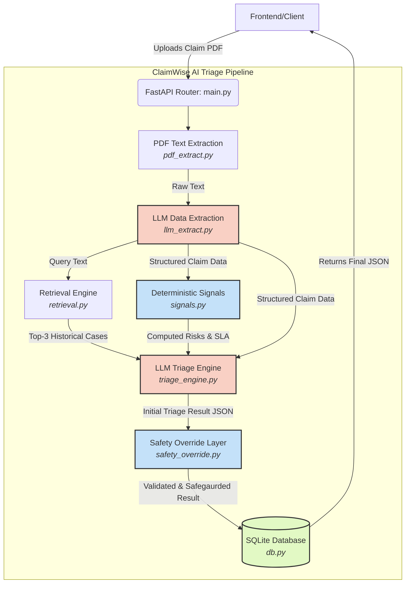

# ClaimWise AI - Backend Architecture

The following diagram illustrates the flow of the backend triage pipeline.

```mermaid
graph TD
    A[Frontend/Client] -->|Uploads Claim PDF| B(FastAPI Router: main.py)
    
    subgraph ClaimWise AI Triage Pipeline
        B --> C[PDF Text Extraction<br><i>pdf_extract.py</i>]
        C -->|Raw Text| D[LLM Data Extraction<br><i>llm_extract.py</i>]
        
        D -->|Structured Claim Data| E[Deterministic Signals<br><i>signals.py</i>]
        D -->|Query Text| F[Retrieval Engine<br><i>retrieval.py</i>]
        
        F -->|Top-3 Historical Cases| G[LLM Triage Engine<br><i>triage_engine.py</i>]
        E -->|Computed Risks & SLA| G
        D -->|Structured Claim Data| G
        
        G -->|Initial Triage Result JSON| H[Safety Override Layer<br><i>safety_override.py</i>]
        H -->|Validated & Safegaurded Result| I[(SQLite Database<br><i>db.py</i>)]
    end
    
    I -->|Returns Final JSON| A
    
    %% Styling
    classDef llm fill:#f9d0c4,stroke:#333,stroke-width:2px;
    classDef rule fill:#c4e1f9,stroke:#333,stroke-width:2px;
    classDef db fill:#e2f9c4,stroke:#333,stroke-width:2px;
    
    class D,G llm;
    class E,H rule;
    class I db;
```
